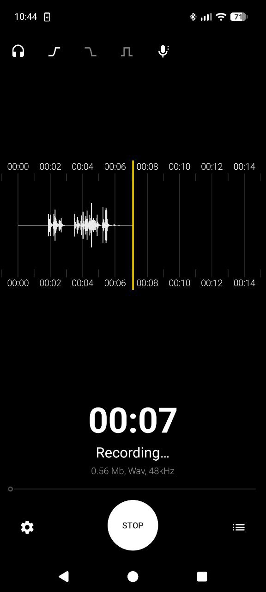

<p align="center">
  
</p>

# FRecorder

**FRecorder** is a fast, no-nonsense field audio recorder for Android — built for real-world use. Whether you're on a film set capturing location sound through a USB audio interface, recording interviews, or just need a reliable pocket recorder, FRecorder gets out of your way and lets you hit record.

Fork of [Dimowner/AudioRecorder](https://github.com/Dimowner/AudioRecorder) with significant additions for casual field recording workflows.



## Features

- **USB Audio Input** — Record from external USB microphones, audio interfaces, and other USB audio devices. Automatically detects connected devices and lets you select them as the recording source. Use a USB audio interface like the Rode AI-Micro or a TRS-to-USB-C adapter like the BOYA BY-K4 to plug in contact mics, lavaliers, or any standard 3.5mm audio source.
- **Live Monitoring** — Listen to what's being recorded in real-time through Bluetooth headphones or the built-in speaker. Toggle on/off before or during recording.
- **Gain Boost** — Adjustable input gain (+6 dB / +12 dB) to amplify quiet sources. Applied in real-time with clipping protection.
- **Noise Reduction** — Optional spectral noise reduction applied on save (WAV only).
- **High/Low-Pass Filters** — Configurable HPF (80/120 Hz) and LPF (9.5/15 kHz) for cleaning up recordings.
- **Noise Gate** — Monitor-only noise gate to cut background noise during live monitoring.
- **Save Formats** — WAV (16-bit or 24-bit), MP3 (320 kbps via LAME), and FLAC (lossless). Recording is always done internally in WAV for maximum quality; conversion happens on save.
- **Bit Depth** — Selectable 16-bit or 24-bit WAV output.
- **Configurable Audio** — Sample rate (8–48 kHz), mono/stereo, audio input device selection.
- **Setup Wizard** — First-run wizard with output format, bit depth, sample rate, channels, audio input selection, and recording permission request.
- **Fast Startup** — Optimized to launch quickly so you never miss a take.
- **Visual Waveform** — Real-time waveform display during recording and playback.
- **File Management** — Rename, share, import, bookmark, trash/restore recordings. Built-in file browser.
- **Themes** — Multiple color themes to personalize the app.

## Format Changes from Upstream

Removed support for **3GP** and **M4A** recording formats. These were low-quality legacy formats not suited for field recording. All recording is now done in WAV internally, with the user choosing the output/save format (WAV, MP3, FLAC).

### Why no 32-bit float?

32-bit float recording is not supported because:

- **Hardware limitation** — virtually all Android phone microphones and most USB audio interfaces used with phones have 16-bit or 24-bit ADCs. There is no real 32-bit data coming from the hardware, so a 32-bit file would just be zero-padded 16-bit samples wasting disk space.
- **File size** — 32-bit doubles the file size compared to 16-bit with no audible benefit for capture.

## Disclaimer

This is not a professional-grade recorder — don't expect noise-free recordings from a phone. That said, you can get pretty acceptable results with the noise reduction enabled on save or the noise gate active during monitoring.

## Credits

FRecorder is based on [Audio Recorder](https://github.com/Dimowner/AudioRecorder) by Dmytro Ponomarenko.

## License

```
Copyright 2019 Dmytro Ponomarenko
Copyright 2026 vdo

Licensed under the Apache License, Version 2.0 (the "License");
you may not use this file except in compliance with the License.
You may obtain a copy of the License at

http://www.apache.org/licenses/LICENSE-2.0

Unless required by applicable law or agreed to in writing, software
distributed under the License is distributed on an "AS IS" BASIS,
WITHOUT WARRANTIES OR CONDITIONS OF ANY KIND, either express or implied.
See the License for the specific language governing permissions and
limitations under the License.
```

---

> *"The best microphone is the one you have with you."*
> — adapted from Chase Jarvis
